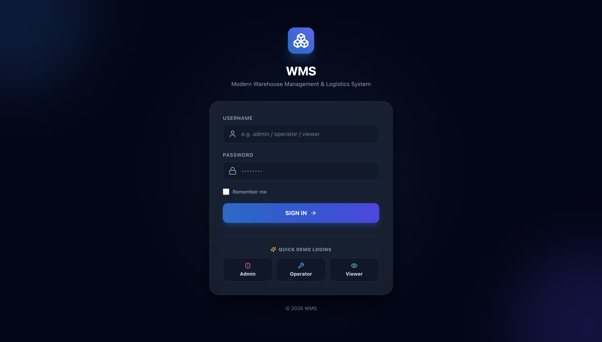
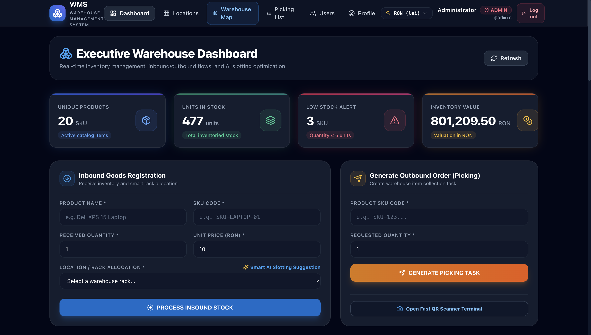
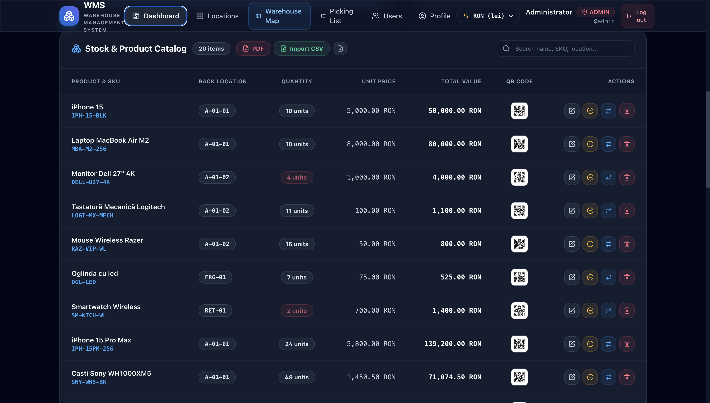
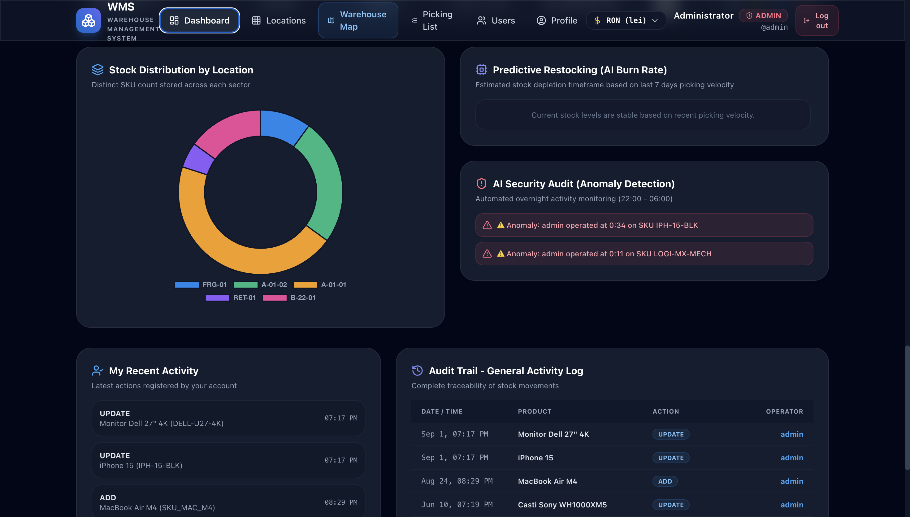
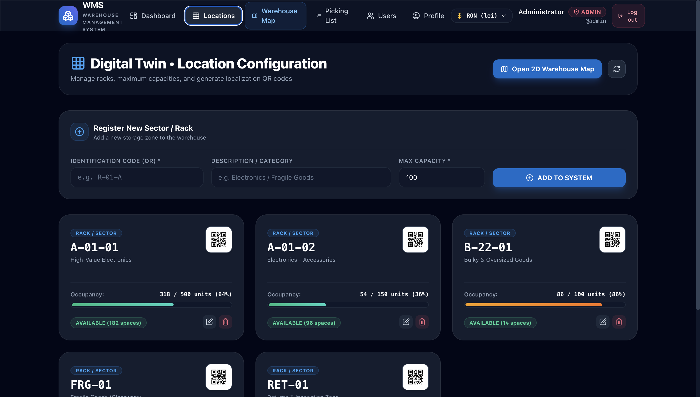
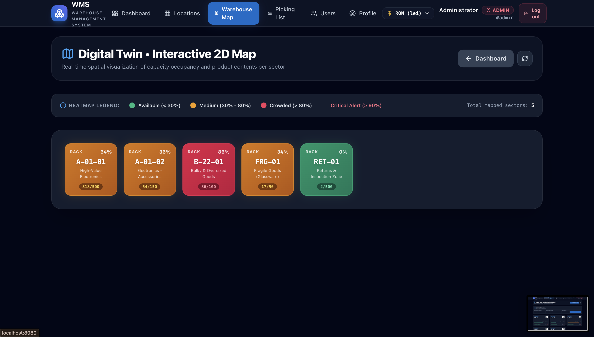
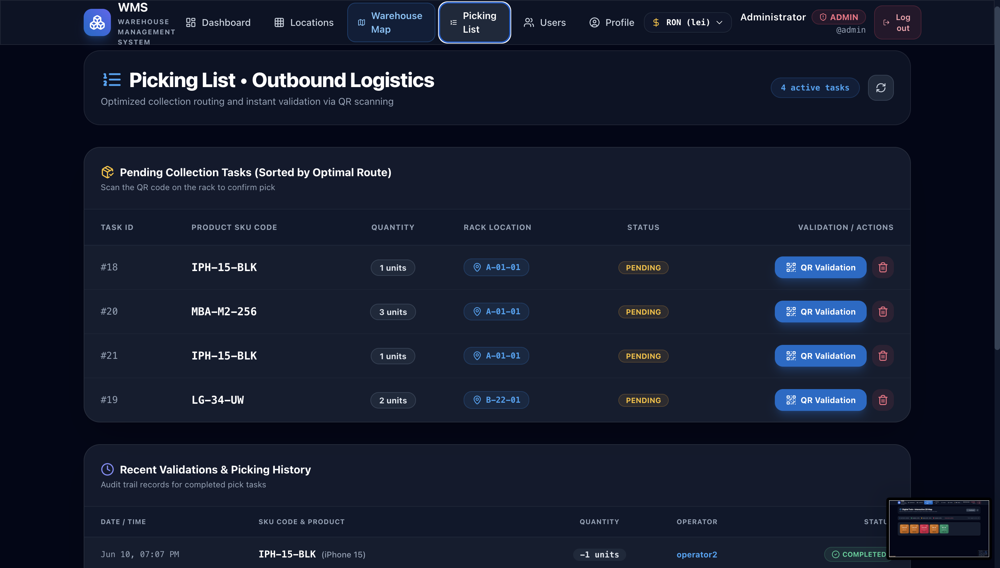
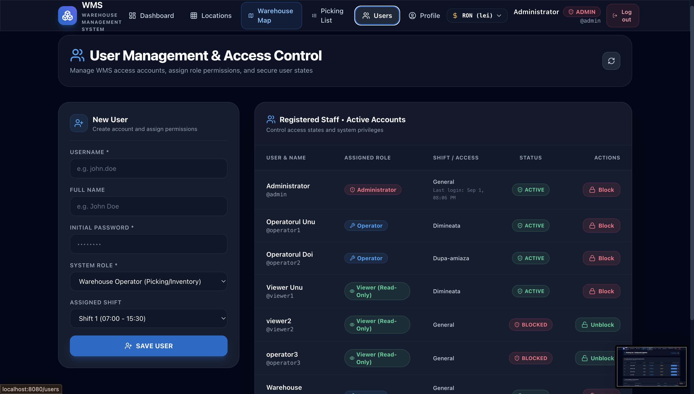
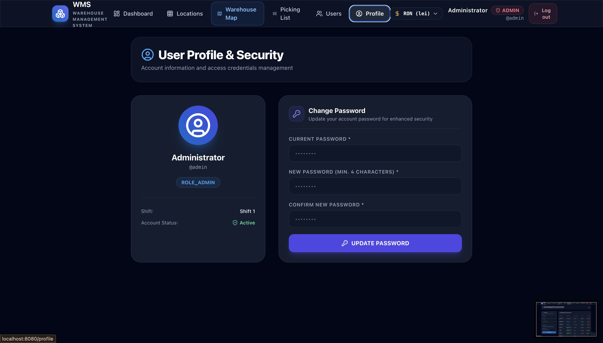

# 📦 Warehouse Management System (WMS)


A full-stack Warehouse Management System built with Java, Spring Boot, React, and MySQL. The system models core warehouse operations including inventory management, inbound/outbound workflows, storage optimization, and order picking. It features optimistic locking for concurrency-safe stock updates, role-based access control, QR-based picking verification, reporting, and an interactive digital twin warehouse map.

## 📸 Application Preview

<table>
  <tr>
    <td align="center" width="33%">
      
      <br />
      <sub><b>1. Authentication & Role Sign-in</b></sub>
    </td>
    <td align="center" width="33%">
      
      <br />
      <sub><b>2. Dashboard & Inbound/Outbound</b></sub>
    </td>
    <td align="center" width="33%">
      
      <br />
      <sub><b>3. Inventory Stock Catalog</b></sub>
    </td>
  </tr>
  <tr>
    <td align="center" width="33%">
      
      <br />
      <sub><b>4. Distribution & Consumption Insights</b></sub>
    </td>
    <td align="center" width="33%">
      
      <br />
      <sub><b>5. Storage Racks & Capacity</b></sub>
    </td>
    <td align="center" width="33%">
      
      <br />
      <sub><b>6. Digital Twin 2D Heatmap</b></sub>
    </td>
  </tr>
  <tr>
    <td align="center" width="33%">
      
      <br />
      <sub><b>7. Picking Queue & QR Verification</b></sub>
    </td>
    <td align="center" width="33%">
      
      <br />
      <sub><b>8. User Management & RBAC</b></sub>
    </td>
    <td align="center" width="33%">
      
      <br />
      <sub><b>9. User Profile & Password Update</b></sub>
    </td>
  </tr>
</table>

## Why This Project

This project goes beyond basic CRUD by modeling real-world warehouse operations and the engineering challenges involved in inventory management.

## Key Features

| Feature | Description |
|---|---|
| **Inventory Management** | Product catalog with SKU search, pagination, low stock threshold alerts, and stock adjustments |
| **Inbound & Outbound Flows** | Goods receipt registration and outbound picking order fulfillment workflows |
| **Role-Based Access Control** | Spring Security authorization with scoped Admin, Operator, and Viewer permissions |
| **Smart Slotting Algorithm** | Heuristic engine evaluating rack capacities to suggest suitable storage locations |
| **QR Code Integration** | Dynamic QR generation (ZXing) and camera scanning (HTML5-QRCode) for pick verification |
| **Audit & Traceability** | Log history capturing stock adjustments with operator identity and timestamp |
| **Reporting & Data Export** | PDF inventory report generation (iText 7) and CSV bulk import/export (OpenCSV) |
| **Digital Twin Visualization** | Interactive 2D spatial heatmap of warehouse sectors and occupancy |
| **Consumption Insights** | Restocking timeframes estimated from 7-day consumption burn rate and off-hours activity audit |

## Architecture

```
                   ┌───────────────────┐
                   │    React SPA      │
                   │ Vite + Tailwind   │
                   └─────────┬─────────┘
                             │ HTTP/JSON
                             ▼
                   ┌───────────────────┐
                   │ Spring Boot API   │
                   │   REST + Security │
                   └─────────┬─────────┘
                             │
              ┌──────────────┼──────────────┐
              ▼              ▼              ▼
         Services         Flyway          Actuator
              │
              ▼
         Spring Data JPA
              │
              ▼
          MySQL 8
```

### Continuous Integration

```
GitHub Repository ──> GitHub Actions (CI) ──> Tests ──> Multi-Stage Docker Build
```

### Design Principles

- **Separation of Concerns:** JPA Entities remain persistence-focused; immutable Java record DTOs define the API contract.
- **Transactional Integrity:** Service layer manages business rules, capacity constraints, and inventory logs within `@Transactional` boundaries.
- **Structured Error Handling:** Global `@RestControllerAdvice` translates validation errors and domain conflicts into predictable JSON error responses.

## REST API Overview

All business API endpoints are versioned under `/api/v1` (with authentication routes under `/api/auth`):

| Resource | Methods | Description |
|---|---|---|
| `/api/auth` | `POST /login`, `POST /logout`, `GET /me` | Authentication session & user state |
| `/api/v1/locations` | `GET`, `POST`, `PUT`, `DELETE`, `GET /suggestions` | Storage sector management and smart slotting recommendations |
| `/api/v1/products` | `GET`, `POST`, `PUT`, `DELETE`, `PATCH /stock`, `POST /transfer`, `POST /import`, `GET /export/pdf` | Product inventory, stock adjustments, CSV bulk import, and PDF export |
| `/api/v1/outbound-orders` | `GET`, `POST`, `POST /confirm-pick`, `POST /scan-confirm`, `DELETE` | Order picking workflow and QR scan confirmation |
| `/api/v1/dashboard` | `GET` | Aggregated KPI metrics, estimated restocking timeframes, and audit logs |
| `/api/v1/admin/users` | `GET`, `POST`, `PATCH /{id}/toggle` | Staff user account management (Admin only) |
| `/api/v1/profile` | `POST /change-password` | Self-service credential update |

Interactive OpenAPI documentation is accessible at `/swagger-ui/index.html` (machine-readable specification at `/v3/api-docs`).

## Tech Stack

- **Backend:** Java 17, Spring Boot 3.4, Spring Data JPA, Spring Security, Hibernate, Flyway
- **Frontend (SPA):** React 18, Vite, Tailwind CSS, Lucide Icons, Chart.js, HTML5-QRCode Scanner
- **Database:** MySQL 8 (Development & Production), H2 (Tests)
- **Testing Infrastructure:** JUnit 5, Mockito, Spring Security Test, Testcontainers
- **Libraries:** ZXing (QR code processing), iText 7 (PDF document export), OpenCSV (CSV parsing), Springdoc OpenAPI 2.8 (Swagger UI)
- **DevOps & Tooling:** Docker, Docker Compose, Multi-stage Dockerfile, GitHub Actions CI

## Profiles & Configuration

| Profile | Purpose | Description |
|---|---|---|
| **`dev` (Default)** | Local Development | Configured for local MySQL (`localhost:3306`) and convenient execution from IntelliJ IDEA or `./mvnw spring-boot:run` |
| **`docker`** | Docker Compose | Uses MySQL from the Docker network, initializes demo data, and runs the full-stack application through Docker Compose |
| **`prod`** | Production Deployment | Requires explicit environment variables (`DB_URL`, `DB_USERNAME`, `DB_PASSWORD`, `JWT_SECRET`) and validates the database schema via Flyway |

Copy `.env.example` to `.env` to configure your local environment settings.

## Getting Started

### Prerequisites

For the recommended Docker setup:
- **Docker Desktop** with Docker Compose

For local development without Docker:
- **Java 17**
- **Node.js 20+** & **npm**
- **MySQL 8**

---

### 1. Frontend Development (Hot Reload)
For development with fast hot module replacement:

```bash
cd frontend
npm install
npm run dev
```
Open in browser: `http://localhost:5173`

---

### 2. Backend Server (Spring Boot)
Start the Spring Boot API server on port `8080`:

```bash
# Run unit and integration tests
./mvnw clean test

# Start Spring Boot application
./mvnw spring-boot:run
```

---

### 3. Full-Stack Run with Docker Compose (Recommended)

The recommended way to run the complete application locally is Docker Compose. It starts the MySQL 8 database and the Spring Boot application, with the React SPA built and bundled into the backend image.

```bash
docker compose up --build
```
The application will be accessible at:

- **WMS:** `http://localhost:8080`
- **Swagger UI:** `http://localhost:8080/swagger-ui/index.html`
- **MySQL:** `localhost:3307` from the host

---

### 4. Local Production Build (Standalone JAR with Bundled SPA)
Compile the React frontend into `src/main/resources/static/` and package into a single executable JAR:

```bash
# 1. Compile frontend assets
cd frontend && npm run build && cd ..

# 2. Package executable JAR
./mvnw clean package

# 3. Run standalone application
java -jar target/wms-0.0.1-SNAPSHOT.jar
```
Open in browser: `http://localhost:8080`

---

## User Roles & Demo Credentials

The Docker Compose setup automatically creates demo users for exploring the application:

| Role | Username | Password | Permissions |
|---|---|---|---|
| **Admin** | `admin` | `admin123` | Full access: User management, Locations CRUD, Products CRUD, Stock adjustments, Exports |
| **Operator** | `operator` | `operator123` | Warehouse operations: Product edit & transfer, Outbound order picking & QR confirmation |
| **Viewer** | `viewer` | `viewer123` | Read-only access: View dashboard metrics, product catalog, warehouse map, audit history |

> **Note:** Demo passwords can be overridden using `ADMIN_PASSWORD`, `OPERATOR_PASSWORD`, and `VIEWER_PASSWORD` environment variables.

## Testing

The automated test suite verifies both domain logic and API contracts:
- **Unit Tests:** `LocationServiceTest`, `OutboundOrderServiceTest`, `ProductServiceTest`, `UserServiceTest`, `AuthServiceTest`, `DashboardServiceTest`, `QrCodeServiceTest`
- **Integration Tests:** `ProductApiIntegrationTest`, `SpaRoutingIntegrationTest`, `CustomUserDetailsServiceTest`
- **Smoke Tests:** `MySqlContainerSmokeTest` (automatically executed when Docker daemon is accessible)

```bash
./mvnw test
```

## Author

**Dennysa-Maria Popescu**
<p align="left">
  <a href="https://www.linkedin.com/in/dennysa-popescu-4938a9263">
    
  </a>
  <a href="https://github.com/dennysapopescu">
    
  </a>
</p>
